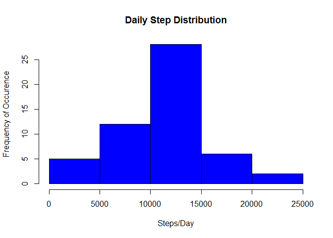
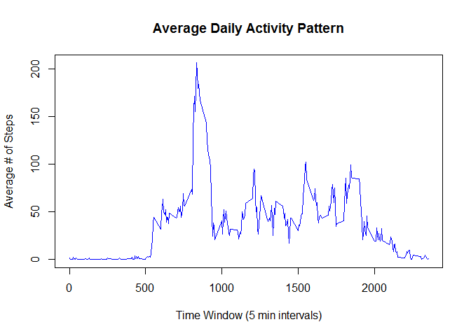
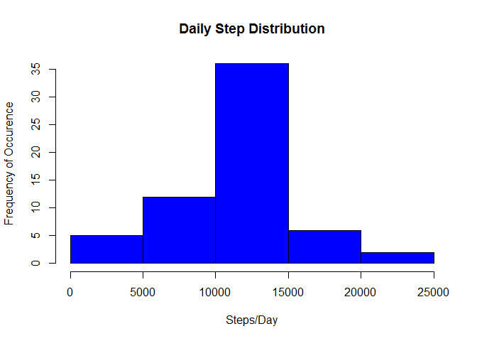
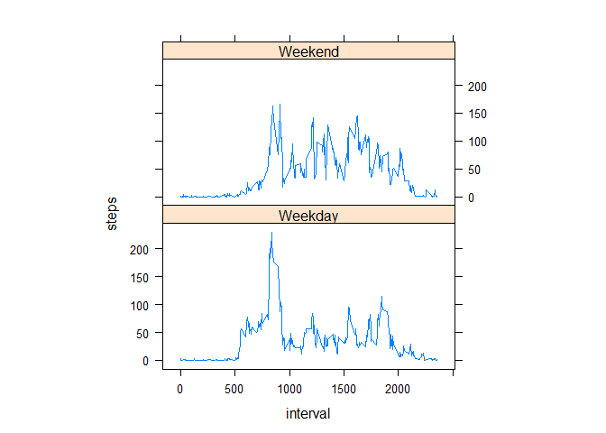

# Reproducible Research: Peer Assessment 1
## Loading extra packages for analysis

```r
library(data.table)
```

```
## Warning: package 'data.table' was built under R version 3.1.2
```


## Loading and preprocessing the data
Dependency: the unzipped file activity.csv should be present in the same folder as PA1_template.Rmd
Loading data using read.csv and evaluating:

```r
activity = read.csv("activity.csv", stringsAsFactors=FALSE)
str(activity)
```

```
## 'data.frame':	17568 obs. of  3 variables:
##  $ steps   : int  NA NA NA NA NA NA NA NA NA NA ...
##  $ date    : chr  "2012-10-01" "2012-10-01" "2012-10-01" "2012-10-01" ...
##  $ interval: int  0 5 10 15 20 25 30 35 40 45 ...
```
The dates column shows dates aren't formatted as the right class. So let's fix that.

```r
activity$date <- as.Date(activity$date)
```

To answer the first two questions, we'll need to temporarily strip the NAs (missing values) out.
To do so, I've created a new dataset, complete_only, containing the steps that are not NAs.

```r
all_complete <- complete.cases(activity)
```
To make the code read more easily I'll subset a few more things and stick this all in one data table, whose structure is shown below.

```r
steps <- activity$steps[all_complete]
date <- activity$date[all_complete]
interval <- activity$interval[all_complete]
noNAdt <- data.table(date, interval, steps)
str(noNAdt)
```

```
## Classes 'data.table' and 'data.frame':	15264 obs. of  3 variables:
##  $ date    : Date, format: "2012-10-02" "2012-10-02" ...
##  $ interval: int  0 5 10 15 20 25 30 35 40 45 ...
##  $ steps   : int  0 0 0 0 0 0 0 0 0 0 ...
##  - attr(*, ".internal.selfref")=<externalptr>
```

## What is mean total number of steps taken per day?

```r
dailytotals <- rowsum(steps, date)
```

First, let's look at the histogram as a first pass:

```r
hist(dailytotals, main = "Daily Step Distribution", xlab = "Steps/Day", ylab = "Frequency of Occurence", col="blue")
```

 

And now to calculate the mean is just a simple call on dailytotals:

```r
mean(dailytotals)
```

```
## [1] 10766.19
```


## What is the average daily activity pattern?
To answer this question we need to aggregate the steps by interval across all the days. I return to the NA-stripped data table and create a new dataframe to plot the time series.


```r
dailypattern <- tapply(noNAdt$steps, noNAdt$interval, mean)
plot (y = dailypattern, x = names(dailypattern), type = "l", main="Average Daily Activity Pattern", xlab="Time Window (5 min intervals)", ylab="Average # of Steps", col="blue")
```

 

We can then subset using the maximum function to find the interval whose average number of steps is the highest.

```r
dailypattern[dailypattern==max(dailypattern)]
```

```
##      835 
## 206.1698
```


## Imputing missing values
Going back to the original dataset, how many NAs are there? A little playing around with sums shows that there are 2304 of them, all within the steps variable.

```r
sum(is.na(activity$steps))
```

```
## [1] 2304
```

```r
sum(is.na(activity))
```

```
## [1] 2304
```

Given the high variance in activity level throughout the day, the most sensible way to impute the missing values at a first pass appears to be to take the average activity for that 5-minute interval and substitute it for the NA values. The following code creates a new dataset, act_imputed, in which the missing values are filled in using the interval mean from the 3rd column in the dailypattern dataset used to create the time series visualization above.


```r
act_imputed = activity
act_imputed[which(is.na(act_imputed$steps)),1]<-dailypattern[as.character(act_imputed[which(is.na(act_imputed$steps)),3])]
```

We can confirm we've replaced the missing values by checking the number of NAs in the new dataset:


```r
sum(is.na(act_imputed))
```

```
## [1] 0
```

And then we can plot a histogram for this new dataset to see whether imputing the NA values has had a substantial effect on the overall distribution of our activity data.


```r
imputed_dailytotals<-tapply(act_imputed$steps, act_imputed$date, sum)
hist(imputed_dailytotals, main = "Daily Step Distribution", xlab = "Steps/Day", ylab = "Frequency of Occurence", col="blue")
```

 


```r
mean(imputed_dailytotals)
```

```
## [1] 10766.19
```

```r
mean(dailytotals)
```

```
## [1] 10766.19
```

```r
median(imputed_dailytotals)
```

```
## [1] 10766.19
```

```r
median(dailytotals)
```

```
## [1] 10765
```

These are quite tiny effects - the mean is the same, and the median of the imputed values containing data set is slightly greater. 

## Are there differences in activity patterns between weekdays and weekends?
Okay, let's look again at how the new imputed dataset is set up:

```r
head(act_imputed)
```

```
##       steps       date interval
## 1 1.7169811 2012-10-01        0
## 2 0.3396226 2012-10-01        5
## 3 0.1320755 2012-10-01       10
## 4 0.1509434 2012-10-01       15
## 5 0.0754717 2012-10-01       20
## 6 2.0943396 2012-10-01       25
```


First let's use POSIXlt to distinguish between weekends and weekdays as a factor:

```r
act_imputed$day <- factor(ifelse(as.POSIXlt(act_imputed$date)$wday %% 6 == 0, "Weekend", "Weekday"))
```

And then use the lattice package to plot a comparison of weekdays vs. weekend steps:


```r
comparison = aggregate(steps ~ interval + day, act_imputed, mean)
library(lattice)
xyplot(steps ~ interval | factor(day), data = comparison, aspect = 1/2, type = "l")
```

 

Visually, it's easy to see the distinction between the activity distributions on the two types of days. The person wearing the activity monitor appears to be waking up slightly later on the weekends, and has a higher burst of activity levels towards the start and end of their days on weekdays. Perhaps this individual has a commute that involves walking to work (or to public transit) on weekdays.
